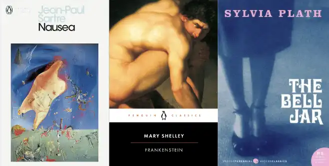

# Book Recommendation Quiz

This book recommendation quiz has been created to allow users to answer questions about their reading preferences, and receive three personalised book recommendations based on the answers they select. This quiz is designed so that it can be taken on any device, regardless of size or model, and still promote a positive and clear user experience. 

* As a note, the responsive site images seem to differ from the images I get from Chrome Dev Tools, with the responsive mockup being less aesthetically pleasing in terms of padding and content placement. I'm unsure why this is so do not know how to rectify it, but is only a slight issue.

[Link to the book recommendation quiz](https://skyeh-m.github.io/Book-recommendation-quiz/)

## Contents 

* [User Experience (UX)](#user-experience-ux)
  * [Project Goals](#project-goals)
  * [Developer and Business Goals](#developer-and-business-goals)
  * [User Stories](#user-stories)

* [Design](#design)
  * [Colour Scheme](#colour-scheme)
  * [Typography](#typography)
  * [Icons and Images](#icons-and-images)
  * [Features](#features)
  * [Accessibility](#accessibility)
  * [Wireframes](#wireframes)

* [Technologies Used](#technologies-used)
  * [Languages Used](#languages-used)
  * [Frameworks, Libraries & Programs Used](#frameworks-libraries-and-programs-used)

* [Deployment](#deployment)
  * [Local Deployment](#local-deployment)

* [Testing](#testing)
  * [Automated Testing](#automated-testing)
    * [W3 Nu HTML Validator](#w3-nu-html-validator)
    * [W3C CSS Validation Service](#w3c-css-validation-service)
    * [Wave](#wave-testing)
    * [Lighthouse](#lighthouse-testing)
    * [JS Hint](#js-hint)
  * [Manual Testing](#manual-testing)
  * [Bugs](#bugs)

* [Credits](#credits)
  * [Code Sections](#code-sections)
  * [Media](#media)
  * [Text](#text)
  * [Acknowledgements](#acknowledgements)

## User Experience (UX)
### Project Goals
The principal goal for this book recommendation quiz site is to allow users to read each of the 10 questions, select an answer for each based on their preferences, and then receive personalised book recommendations. 

* The quiz allows a user to input their name, or a username, so that when given recommendations this is displayed with their name. For example, upon submitting the quiz text will appear stating "Hi (insert username here), you got (insert genre here)! We recommend the following books...". This creates a more personalised feel to the delivery of the recommendations.
* Once a user has answered all 10 questions a message will be displayed, as mentioned above, stating the genre the user has been matched with, this is accompanied by an image of the three book covers corresponding to the genre selected by the user's answers. 
* The quiz will allow users to retake the quiz as many times as they like, either by refreshing the browser, or by clicking the Restart button. This is so that users can see which other books are recommended, or even share the quiz with friends from their own device. 

### Developer and Business Goals
* The footer includes social media icons which contain links to various social media platforms. This pertains to a developer and business goal of encouraging users to visit the content of the business who created the quiz. This seems most appropriate for a book shop where a book recommendation quiz may be utilised to encourage customers to purchase new books they have yet to discover. 
* A key developer goal for this project was to ensure full accessibility for all users of the quiz. This goal informed my decision to not create a quiz with correct answers and a timer as I didn't want to rush users. Part of this consideration was with dyslexic individuals in mind as it will take different people different amount of time to read text.
* A business goal could be to encourage users to share their personalised book recommendations with others, thereby advertising the company behind the quiz. With this in mind there are no copyright images used on the site so users can share screenshots of their results on social media if they wish.

### User Stories
As a user I want to be able to...

1. Read each question and answer clearly, with no text being confusing or obscured by anything else
2. To be able to take the quiz on any device, regardless of size or model, and have a good, uncomplicated experience which only differs slightly depending on screen size. This includes all key functionality of the site working on mobile, tablet, and desktop
3. Answer each of the 10 questions and be provided with an accurate group of recommendations that suit the answers I selected
4. To be able to restart the quiz if I change my mind on an answer for a question I've already answered, and for this to have no negative consequences
5. To be recommended books I might not be familiar with already, but are still likely to interest me

## Design
### Colour Scheme

The colour scheme of the book recommendation site is comprised mainly of white, different shades of green, and black. 

* White was chosen to focus the eye, and remove background distractions, particularly for the option boxes, so that text was easily readable. Similarly the colour of the social media icons are white to draw the user's eye to them, with the purpose of promoting the company who created the quiz and thus getting more traction online. 
* Green was selected for the footer background, background of the heading, and the quiz container itself, to add a pop of colour, the different shades of green are both different to one another and are also complimentary, keeping to a clear theme. The green speaks to the theme of books in general by being evocative of greenery, trees, and nature.
* Black was chosen to add contrast and make text clear and readable, especially against a white background. The text being black is also in keeping with text in books always being black against a white page. 

### Typography

[Google Fonts](https://fonts.google.com/) was used to link the fonts used on my site

* Gloock is used for the first header element to create a distinction between the header and the main text of the site. This and the font used for the remainder of the text are complimentary fonts so provide an aesthetic difference without seeming misplaced. 

* Libre Baskerville was selected as the core font of the site as it maintains clear readability while conveying a vintage, literature theme to the site as a whole, in keeping with its content and purpose. Both fonts are serif fonts so sustains a thematic similarity so not to introduce a clash in aesthetic to the typography used.

### Icons and Images

* The Favicon for the site was created using the [Favicon](https://favicon.io/) website, and the icon files were downloaded and saved to my Gitpod workspace. The book icon was chosen to keep in theme with the book recommendation site and to allow users to easily recognise the website tab amidst others in their browser.
* The two book images on the site, the first being on the modal when the site loads, and the second being the main background image of the site, were sourced from [Unsplash](https://unsplash.com/). No rights are my own, and images will be credited later on in this document.
* The image featured on the modal was chosen as books are the key theme of the site, and the unfocused aspect of the image ensures that the image quality won't suffer when translated to smaller, or larger screen sizes. The unfocused nature of the image also serves to give users a thematic representation of what the content of the site will be, without distracting them from the informative text on the modal.
* The background image featuring a page from a book was chosen again for its thematic value, but also to provide an aesthetic element to improve the visual aspect of the site. In my opinion, the background image is not distracting to users, especially as the container for questions and answers has a solid, opaque background color to draw the eye, and allow users to focus on the text. After speaking to my College mentor Robert Mclaughlin I agreed that the text featured in the background image could be distracting to users, he suggested I make this image less opaque to ensure this doesn't become an issue. 
* On the modal there is an icon of a white book, this was sourced from [Font Awesome](https://fontawesome.com/) and used to create a break in the amount of text featured on the modal. 
* The recommendation images featured at the end of the quiz have been sourced from various publishers, or book retail sites that will be individually credited later in this document. 

### Features
The book recommendation quiz is comprised of three main sections, the modal screen, the question and answer area, and the recommendation area.

| Section | Feature | Photograph or gif |
| ----- | ----- | ----- |
| The modal appears on page load and prompts the user to enter their name, or a username, and gives users information about the quiz. | The background colour of the modal was originally a semi-transparent light green, this was later altered to match the dark green on the footer. This was due to an issue of insufficient colour constrast being raised by the Lighthouse program, in order to maintain good readability of text the colour was changed and this issue was resolved. |  |
| | The username field value is stored and then retrieved later on for the recommendation section, and can be submitted by either clicking the submit button, or hitting the enter key. This is to provide users greater choice in submitting a field, and to avoid a user hitting the enter key and being unsure as to why this hasn't submitted the form. |  |
| | The modal also informs users that they should answer each of the 10 questions posed, and then click the submit button in order to receive their recommendations. |  |
| | The button that closes the modal is featured prominantely in the top right corner of the modal and upon hovering over it changes colour to black to inform users that the button is clickable. |  |
| The question and answer area is comprised of 10 questions, each with 4 options to select from. | Upon hovering over an option the option box changes from white to light green in colour to emphasise to the user which button they're selecting. Also on the advice of my mentor Akshat, the final option (once clicked) changes to a dark green to signify that the quiz has come to an end and that the submit button should now be clicked. |  |
| | Once an option has been clicked the quiz automatically moves on to the next question and it's related options. My original design included buttons which would move to the previous, or next question which I removed as I felt it'd be easier from a user experience standpoint for the quiz to move along automatically. This also reduced the risk of having 3 or 4 buttons along the button of the quiz area, which may clutter the screen. |  |
| | The Restart button sits at the bottom of the question area and can be clicked on at any point in the quiz to return the user to the first question. This button exists to allow the user to change the option they've selected for any question if they change their mind, or simply so they can replay the quiz to try to get a different recommendation. |  |
| Finally, there is the recommendation area which acknowledges the user by name, and provides an image of three books that would be of interest to the user based on the options they selected. | The user is first greeted by a message stating 'Hi (username), you got (genre)! We recommend the following books...'. This is dynamically generated in the following way, the username is held in sessionStorage once entered by the user, and then retrieved for use in this message. The name of the genre selected for the user is displayed by a function called mostFrequent which calculates which genre to select based on the options chosen by the user. |  |
| | The image of the 3 books that are recommended to the user is displayed using the displayGenre function which creates an empty image element and then inserts the image that corresponds to the relevant genre result. |  |
| | The submit button for the quiz only appears when the user has reached question 10 of the quiz. This is so that users don't click submit too early, and to suggest that the submit button should be clicked when it appears. |  |

 * Future Implementations:
   * In the future it'd be beneficial to extend the amount, and complexity of the questions asked and the options available. Rather than having each genre assigned to a button, for example the first button always representing the Non-Fiction genre, it'd be preferable to have the options appear in different orders so that it's not obvious to the user which genre each button/option corresponds to. 
   * In addition, it'd be useful to have this book recommendation quiz be a part of something larger, most logically this would be associated with an online book shop. In that case there would be clear branding included in the site rather than it just being an anonymous quiz. This would also make the social media links more logical and relevant than as the project currently stands.
   * In the future the site could be expanded to have the book recommendation image seperated into 3 individual images showcasing each book. This could be used to allow users to click a book image and be directed to where they can purchase this book. Alternatively, clicking an individual book image could bring up a modal which provides some information about the book chosen such as the blurb or a review. 
   * In terms of accessibility, there are multiple things that I'd like to add to my site to ensure that everyone can use the site regardless of their individual abilities. For example, I'd like to implement light mode/dark mode functionality for those who may struggle with reading text against certain colours, or those with sensitive eyes. I'd also like to have some inbuilt reading function where a program could read out quiz questions and answers to users so those who are visually impaired aren't excluded.
   * Although the alerts I've implemented to encourage users to enter a username before submitting the username field, and attempting to close the modal function well they aren't aesthetically pleasing. I'd like to look into a way to communicate these important aspects to the user in a way that improves user experience and design.

### Accessibility

Throughout the creation of this project I have considered facets and issues of accessibility. This, as mentioned above, formed part of my decision to not create a text based quiz with a timer, in order to be sensitive to the accessibility needs of users with dyslexia or others with differing needs. 

[Lighthouse Accessibility Score](./docs/accessibility-score.png)
My Lighthouse score for accessibility is 100% which I am very pleased with, this was achieved by the following methods and considerations.
* I used dyslexia friendly fonts on my site and ensured that text always remained large enough to read no matter the screen size, this was done using a mobile first development approach, and the use of media queries for larger screens.
* I included semantic html throughout along with descriptive, yet brief, alt tags for all images and used aria labels wherever necessary, primarily for buttons to ensure a smooth experience for users who use screen readers.
* I utilised the [Ally Color Contrast Accessibility Validator](https://color.a11y.com/Contrast/) to check for any colour contrast issues on my site. This returned a message of "Congratulations! No automated color contrast issues found on the webpage tested.". My site previously flagged a colour contrast issue based on my modal having a light green semi-transparent background colour. With this feedback in mind I altered my modal background to match the dark green of the footer and made the background colour opaque for better accessibility and visibility. 
* I used the [WAVE](https://wave.webaim.org/) Web Accessibility tool to test my site for any accessibility errors or improvements that could be made. My result from this assessment stated that no errors were detected in code content, or in regards to colour contrast.

### Wireframes

* To begin the design of my project I created wireframes of the question and answer area of my quiz, and the recommendation area for desktop, tablet, and mobile screen sizes. The images of these will be provided below
* [Question area wireframe](./docs/wireframe-QA.png)
* [Recommendation area wireframe](./docs/wireframeRA.png)
* Alterations: 
* As you can see the wireframes differ slightly from the finished design of the quiz site. This is predominately to do with the removal of the 'next' and 'previous' buttons, along with the submit button being hidden until the user reaches question 10. The next and previous buttons were removed as the quiz progresses automatically to the next question once an answer is selected to I thought it best to simplify the design and remove unnecessary buttons. This particularly benefit the mobile screen size as it avoided a sense that the button area was cluttered. I thought the previous button to also be unnecessary given that the user could click restart at any point and be returned to the first question, if this quiz were longer than 10 questions I would reimplement a previous button to save a user from having to spend too much time re-answering questions 
* The final key change to mention is the exclusion of the modal screen on my wireframes, the inclusion of the modal to my quiz was only made towards the very end of development and so hadn't been planned for at the time in which the wireframes were created. 

### Languages Used
* HTML, CSS and JavaScript were used to complete this project, I previously utilised jQuery to target and hide elements when necessary but reverted this to plain JavaScript for ease of understanding and conformity to the rest of my script.js file

### Frameworks, Libraries, and Programs Used
* [Adobe XD](https://helpx.adobe.com/uk/support/xd.html) was used to create the Wireframes seen above
* [ALLY](https://color.a11y.com/) was used to test for colour contrast issues on the site
* [Favicon](https://favicon.io/) was utilised to create a Favicon for my site's browser tab
* [Font Awesome version 6](https://fontawesome.com/) was used for the open book icon featured on my modal 
* [Gifox](https://gifox.app/) was used to create a video/gif to demonstrate hover effects and quiz functionality for the purposes of this readme file
* [Github](https://github.com/) was used to store the repository for this quiz project, with Github Pages hosting the site
* [Gitpod](https://www.gitpod.io/) is the environment in which this project was created and worked on
* Google Chrome Developer Tools was used as a debugging tool, and to help visualise the site in different screen sizes to ensure that user experience remained clean and efficient no matter the device utilised by the user
* [Google Fonts](https://fonts.google.com/) provided the links for both fonts used on the site, and aided in selecting fonts that are complimentary to one another
* [JSHint](https://jshint.com/) provided a testing platform to ascertain whether my script.js file met industry standards, and to ensure no errors were found in the use of JavaScript for my site
* [Tech Sini](https://techsini.com/multi-mockup/index.php) aided in the creation of a multi-device mockup image so that I could test the appearance and functionality of the site on multiple device sizes, and provided the image seen at the beginning of this document
* [WAVE](https://wave.webaim.org/) Web Accessibility Evaluation Tool was used to test my site against accessibility criteria, the results of which informed multiple changes to my site. This includes the modal background color change, and changes to the alt text used to describe images
* [Web Formatter](https://webformatter.com/) was used to format my code, predominantly the JavaScript file, to make the file more readable and to adhere to industry standards of file layout

### Deployment 

The book recommendation quiz website is deployed using Github Pages, this was done by:

1. Login to Github
2. Navigate to the account SkyeH-M, and locate the Book-recommendation-quiz repository
3. In this repository click on the Settings tab
4. In the Code and Automation subheading in the sidebar click on Pages
5. Under Build and Deployment find the Source section, set the source to deploy from a branch, and set this branch to main, and the folder option to /root 
6. Click save, wait a few minutes and the book recommendation site is now deployed at the URL displayed

## Local Deployment
### How to Clone 

1. Locate the main page of the Book-recommendation-quiz repository, click the Code button to the left of the green Gitpod button
2. Copy the URL of the repository, you can click on headings for HTTPS, SSH, and Github CLI to find their individual links
3. Open your own terminal in your editor and change the current working directory to the location of where you want the cloned directory to be
4. In the terminal type git clone, and then paste the URL you copied from the Book-recommendation-quiz repository page
5. Press enter to complete

### How to Fork

1. Locate the main page of the Book-recommendation-quiz repository
2. Click the fork button in the top right of the screen, between the watch, and star buttons

## Testing
## Automated Testing

### W3 Nu HTML Validator 

The Nu HTML Validator was used throughout the development and testing of this site to ensure there was no faulty, or below standard, HTML used. Below is a screenshot to demonstrate that no warnings or errors were raised for the use of HTML on my site.
* [HTML Validator Report](./docs/HTMLValidator.png)

### W3C CSS Validation Service

The W3C CSS Validation Service was used to check the validity of the CSS used throughout my site, as with HTML this validator returned no errors or warnings.
* [CSS Validator Report](./docs/CSSValidator.png)

### Wave Testing

My site was assessed by the Web Accessibility Evaluation Tool (WAVE) whereby any warnings raised were addressed and resolved
* [WAVE Report](./docs/WAVEReport.png)
* The WAVE report stated that there were no errors on my site, there were however two alerts given.
1. Suspicious alternative text for my modal image where the alt text states "Image of an open book", I don't feel as though this alt text is either insufficient or extraneous and so I have left this as it is.
2. Device dependent event handler for my modal close button, WAVE explains that this isn't accessible to both mouse and keyboard users. My quiz in it's entirety does rely on a user having a mouse and using a smartphone in order to select option buttons and to submit the quiz. Therefore, the device dependent event handler is something that I will address in the future but currently don't feel that it impacts user experience.

### Lighthouse Testing
## Desktop 
* [Lighthouse Report](./docs/desktop-lighthouse.png)
* The lowest score my site received for the Lighthouse desktop review was 92% for Best Practises. This is explained only as having an image displayed with incorrect aspect ratio, the ideal ratio is stated to be 1.50 where my ratio is 1.67 for the modal book image. I do not feel as though this discrepancy provides a negative user experience, nor do I feel as though the image appears stretched or incorrectly displayed. 

## Mobile
* [Lighthouse Report](./docs/mobile-lighthouse.png)
* My Mobile Lighthouse report stated that my Accessibility and SEO scores were 100, with Performance and Best Practises scoring 92. I feel these scores are acceptable, yet something that I endeavour to improve in the future. The Performance score was lower as advised me to 'eliminate render-blocking resources' for my Google Fonts. I have read on StackOverflow that I can place these Google Font links just before the end of my body tag in HTML, yet have been warned that this may mean that fonts appear broken as the page is loading. In order to maximise user experience I've decided to leave the Google Font link in the head of my HTML as the page load score is sufficient. For Best Practises I've again received a warning about displaying images with incorrect aspect ratio. As mentioned above I don't think the image appears stretched or abnormal in any way so have decided to leave the image sizing as is. 

* In regards to scoring 100 on Accessibility and SEO for both mobile and desktop versions of my Lighthouse report this is due to the following efforts. For Accessibility I prioritised using semantic HTML throughout the development of the site, along with aria-labels and alt text wherever necessary. For SEO I included meta tags in the head of my HTML file, including a meta description of the site.

## Improvements Made

* In order to raise my Lighthouse scores slightly I converted all site images to webp format to improve loading times
* Main script files were placed just before the end of the body tag in the HTML file so that basic CSS and HTML is loaded before any JavaScript to promote good user experience and quicker load times

### JS Hint
* [JS Hint Report](./docs/JSHint.png)
* After copying and pasting the entire contents of my JavaScript file into the JS Hint program I originally received 29 warnings. These warnings were predominately due to the use of 'let' and 'const' throughout my file, along with the use of arrow functions. These warnings were removed by adding a comment which updated the JS Hint version to allow the use of let, const, and arrow function syntax. This comment was as follows /*jshint esversion: 6 */ which I found on Slack and was first raised (to my knowledge) by user yoni_emeritus in 2018. After adding this comment my warnings reduced to zero.
* I do have comments mentioning that I have one undefined variable and one unused variable in my script.js file:
* The undefined variable is nfImg, this variable is utilised to display the recommendation image to the user at the end of the quiz, and to hide this image when a user clicks the restart button. I have tried to define this variable outside of the functions in which it's used and this made the image not hide once the restart button was clicked, I am unsure why this is the case. This is something that I will endeavour to fix in the future, but as of now this doesn't impact the user experience of the quiz. 
* The unused variable is storeusername which isn't used in the script.js file but is used in index.html to call the storeUsername function when the username submit button is clicked. This comment from JSHint doesn't seem to impact any of the functionality of my quiz, and is the variable is being used in HTML so I don't think this comment needs to be addressed immediately. 

## Manual Testing
### Testing User Stories
| Aims | Are the aims being met? | Images |
| ----- | ----- | ----- |
| 1. Read each question and answer clearly, with no text being confusing or obscured by anything else | Text is always displayed clearly with no obstruction. Modal blocks quiz questions so they cannot be seen before modal is closed |  |
| 2. To be able to take the quiz on any device, and have a good, experience which only differs slightly depending on screen size. This includes all key functionality of the site working on mobile, tablet, and desktop | The responsivity image shows the site on different screen sizes where all aspects of design and functionality work as expected |  |
| 3. Answer each of the 10 questions and be provided with an accurate group of recommendations that suit the answers I selected | The recommendations and corresponding genres were mapped out before I started building this site. Each recommendation group fits the genre, and questions asked. |  |
| 4. To be able to restart the quiz if I change my mind on an answer for a question I've already answered, and for this to have no negative consequences | The restart button is available from the beginning to the end of the quiz meaning it can be used at any point. When used the genreArray array is set back to 0 meaning past answers are erased, ready for the user to pick new answers |  |
| 5. To be recommended books I might not be familiar with already, but are still likely to interest me | I recommended books that I have read so know that they fit the recommended genre, these books aren't all very well known so fit the aim of introducing users to new books. For the horror genre, Tell Me I'm Worthless, and Her Body and Other Parties are mostly known in smaller, specific horror communities rather than the widespread popularity of Stephen King books for example. |  |

### Full Testing

The entirety of this site has been tested throughout development extensively, including manual and automated testing being done upon completion of this project. 

* Modal area:
  * Username field is automatically focused on upon page load so users are implicitly told to enter their username immediately. This username can be submitted by either clicking the submit button, or by pressing the enter key, this works on all devices from computers and laptops with physical keyboards, and mobile devices. 
  * The modal cannot be closed until a username is entered, if a user tries to close the modal without entering a name an alert is displayed prompting the user to do so. This ensures the quiz results are personalised (by name) to the individual user, and to ensure the user reads the modal before continuing on with the quiz.
  * Similarly the username input field cannot be submitted if the user hasn't entered their name, submitting an empty username field will result in an alert stating 'Please enter your username'.
* Question and answer area:
  * Upon hovering over any question option button on desktop the button will become a light shade of green to indicate which button will be selected if clicked. On mobile or tablet devices hovering isn't possible so the button most recently clicked becomes green instead to indicate which button they just selected for the previous question. 
  * Once an option button is clicked the quiz will always move automatically to the next question, this has been tested on every device available on Chrome Dev Tools, along with an iPhone I own. I have never encountered any issues with this functionality and can confidently suggest that this functionality will always work. Upon answering question 10 the quiz will not move to the next question to indicate to the user that the quiz is over, and that they should press submit to reveal their recommendation. 
  * The restart button can be clicked on any page of the quiz and will always bring the user back to question 1 and allow them to select new answers, with their previous answers being deleted. If the restart button is clicked after the user has received their result the genreArray array will be emptied and the recommendation image is hidden as the first question reappears. When taking the quiz again their recommendation will be accurate to the option buttons selected after pressing restart.
* Recommendation area:
  * The Hi Username message always returns the correct username that was entered into the username field. This field allows the user to enter numbers and characters to suit those who may want to enter an online username rather than their legal first name, so numbers and special characters are never blocked. 
  * I have tested each option button for each question to ensure they're pushing the correct letter into the genreArray array in order to give the correct recommendation. This includes testing what happens if a user selects option button 'A' 5 times, and option button 'B' 5 times. In this case, the quiz will recommend the genre that was first selected by the user, for example, if their first answer was for genre 'A' this will be the one displayed. 
  * No matter the device the quiz submit button only appears once the user reached the 10th question, this is so they don't prematurely submit the quiz without answering all the questions. If a user attempts to press the submit button on the 10th question page without having answered the final question the button will not work. The submit button will only take the user to their recommendation page once 10 option buttons have been selected, one for each of the 10 questions.
* Site wide:
  * The social media links in the footer of the page always open to a new tab when clicked on so that user's aren't permanently directed away from the quiz site.
  * The social media links also turn a dark shade of green (the same as the container background colour) when hovered over on all devices that have a mouse or cursor. 

## Bugs

* Unfortunately I do not have screenshots of all bugs that occured during development, where an image is available it will be included to illustrate the bug.

| Bugs | Have they been solved? | How? |
| ----- | ----- | ----- |
| 1. In early development the startQuiz() function set the currentQuestion variable to 0, set the question and answer text, and defined an onclick function for each button so that when clicked the answer would be pushed into the genreArray. The next function was included like so [Bug 1](./docs/bugs/Bug1.png), this meant that currentQuestion was immediately being set to 9 at the beginning of the quiz as the next function was calling itself and incrementing this variable when undesired | Yes |Kevin from tutor support advised that I place the currentQuestion if statement inside my onclick function so the next function was only called when an option button was clicked, e.g [Bug 1 fixed code](./docs/bugs/Bug1Solved.png) |
| 2. When attempting to insert an image into the quiz I was unable to get the image to fit within the question-area div, leading to the following result [Bug 2](./docs/bugs/Bug2.png). This is due to my JavaScript code using document.body.appendChild with the file path of an image, meaning the image was being added to the body, next to the quiz container. The image [here](./docs/bugs/bug2a.png) shows the code previously used  | Yes | To solve this bug I instead used JavaScript to create an image element, set the file path of this image element to be that of the recommendation image chosen for the user. Then targetted a div in my index.html file with the id of nfImg to target the recommendation area as being where the image will appear, and added the image using the appendChild method. This placed the image exactly where it needed to be inside the container |
| 3. Not a bug, but rather an improvement that needed to be made was suggested by my mentor Akshat, I was originally using a prompt to ascertain the user's name [like so](./docs/bugs/Bug3UX.png) which was explained to me to be poor user experience and design | Yes | The prompt was changed to a username label, field, and submit button within the modal on the page to be less obtrusive and offer a better user experience [e.g](./docs/username-field.png) |
| 4. Before I created the modal to house the username field I put it above the first question and intended for this field to disappear once the username had been entered. I encountered a bug whereby after a user entered their name the field would remain on the page for each of the 10 questions, [e.g](./docs/bugs/bug4.png) | Yes | Firstly, I removed the username field from the question area and placed it instead in a modal to seperate the two areas. I then used the DOM display property to set the username field to 'none' once a username had been entered and submitted. Upon entering a username and submitting the form the username field is hidden and the user can now click the 'X' to exit the modal and begin the quiz |
| 5. The image of recommended books is displayed to the user after the quiz is submitted, however upon clicking the restart button the image either remains visible at the first question (sometimes in duplicate), or doesn't appear again once a new recommendation has been issued. [e.g](./docs/bugs/bug5.png) | Yes | As mentioned earlier this was fixed by changing the way I was inserted an image into the site. This was done by creating an image element and populating it with the file path for the relevant recommendation image, removing the hidden class when the recommendation is issued, and adding the hidden class once the restart button is clicked. |
| 6. I had a bug where due to the short screen height my footer wouldn't occupy the bottom of the screen, and instead would rise up to meet the bottom of the content above it, [e.g](./docs/bugs/bug6.png) | Yes | This was rectified with the help of [Matthew James Taylor's article](https://matthewjamestaylor.com/bottom-footer). This article suggested to use CSS to set the to margin and padding of the html and body to 0, and set their height to 100%. In addition, to set the position of the footer to absolute, and its bottom value to 0, after doing so the footer sits at the bottom of the page on every device without being a 'sticky' footer. |
| 7. Finally, when a user entered their name into the username field the username value would always be logged a step behind. For example, if you entered your username as 'A', and logged this value it'd return undefined. If you then refreshed the page and entered your username as 'B', the value of this would be 'A' | Yes | With the help of the tutor Oisin it was suggested that the storedUsername variable should be declared as a global variable outside of the storeUsername function so that it can be accessed. The storedUsername variable is then reassigned within the storeUsername function whenever the username is saved to session storage within this function. |

## Credits 
### Code Sections

* Code sections were predominately found online either for inspiration or to solve an issue that was beyond my current understanding, these sections have been referenced in the code itself but will be fully credited here:
* [The basis for my JavaScript code structure was derived from the following guide, this was considerably changed to fit my purposes](https://www.codingninjas.com/codestudio/library/how-to-create-a-javascript-quiz-code)
* [Most frequent element in an array](https://www.geeksforgeeks.org/frequent-element-array/) to select a recommended genre for a user
* [Window sessionStorage](https://www.w3schools.com/jsref/prop_win_sessionstorage.asp) to store and retrieve the username value
* [How to add an image in HTML via JavaScript](https://linuxhint.com/add-image-in-html-via-javascript/) to insert my recommendation images into the html of the document
* [Get Down! How to Keep Footers at the Bottom of the Page](https://matthewjamestaylor.com/bottom-footer)
* [Create a Modal with HTML, CSS & JavaScript](https://www.youtube.com/watch?v=6ophW7Ask_0)
* [Trigger a Button Click on Enter](https://www.w3schools.com/howto/howto_js_trigger_button_enter.asp)

### Media 

1. [Favicon of Books by John Sorrentino](https://favicon.io/emoji-favicons/books)
2. [Font Awesome book](https://fontawesome.com/icons/book?s=solid&f=classic)
3. [Image on modal by Elisa Calvet B.](https://unsplash.com/photos/S3nUOqDmUvc?utm_source=unsplash&utm_medium=referral&utm_content=creditCopyText)
4. [Background image by Annie Spratt](https://unsplash.com/photos/askpr0s66Rg)
5. [Are Prisons Obsolete? published by Seven Stories Press](https://www.waterstones.com/book/are-prisons-obsolete/angela-davis/9781583225813)
6. [Utopia for Realists published by Bloomsbury Publishing PLC](https://www.waterstones.com/book/utopia-for-realists/rutger-bregman/9781408893210)
7. [Invisible Women published by Random House](https://www.penguin.co.uk/books/435554/invisible-women-by-caroline-criado-perez/9781784706289)
8. [Her Body and Other Parties published by Profile Books Ltd](https://www.waterstones.com/book/her-body-and-other-parties/carmen-maria-machado/9781781259535)
9. [We Have Always Lived in the Castle published by Penguin Classics](https://www.abebooks.co.uk/servlet/BookDetailsPL?bi=30987215073&searchurl=an%3Dshirley%2Bjackson%26pics%3Don%26sortby%3D17%26tn%3Dwe%2Bhave%2Balways%2Blived%2Bin%2Bthe%2Bcastle&cm_sp=snippet-_-srp1-_-title2)
10. [Tell Me I'm Worthless published by Cipher Press](https://www.cipherpress.co.uk/tellmeimworthless)
11. [Nausea published by Penguin Classics](https://www.amazon.co.uk/Nausea-Penguin-Modern-Classics-Jean-Paul/dp/014118549X/ref=asc_df_014118549X/?tag=googshopuk-21&linkCode=df0&hvadid=311043780415&hvpos=&hvnetw=g&hvrand=14705711220892661469&hvpone=&hvptwo=&hvqmt=&hvdev=c&hvdvcmdl=&hvlocint=&hvlocphy=9046357&hvtargid=pla-404289614630&psc=1&th=1&psc=1)
12. [Frankenstein published by Penguin Classics](https://www.amazon.co.uk/Frankenstein-Modern-Prometheus-Penguin-Classics/dp/0141439475/ref=asc_df_0141439475/?tag=googshopuk-21&linkCode=df0&hvadid=310891116626&hvpos=&hvnetw=g&hvrand=4893185580108965700&hvpone=&hvptwo=&hvqmt=&hvdev=c&hvdvcmdl=&hvlocint=&hvlocphy=9046357&hvtargid=pla-494071215115&psc=1&th=1&psc=1)
13. [The Bell Jar published by Harper Collins Publishers Inc](https://www.ebay.co.uk/itm/173289639244?chn=ps&mkevt=1&mkcid=28)
14. [A Little Life published by Knopf DoubleDay Publishing Group](https://www.panmacmillan.com/authors/hanya-yanagihara/a-little-life/9781447294832)
15. [Our Wives Under The Sea published by Picador](https://www.panmacmillan.com/authors/julia-armfield/our-wives-under-the-sea/9781529017250)
16. [My Year of Rest and Relaxation published by Penguin Press](https://www.penguin.co.uk/books/436709/my-year-of-rest-and-relaxation-by-ottessa-moshfegh/9781784707422)

### Text

* All text was written myself, apart from a question concerning quotations which will be credited below in order:
1. [Are Prisons Obsolete?- Angela Y. Davis](https://www.waterstones.com/book/are-prisons-obsolete/angela-davis/9781583225813)
2. [Her Body and Other Parties- Carmen Maria Machado](https://www.waterstones.com/book/her-body-and-other-parties/carmen-maria-machado/9781781259535)
3. [Nausea- Jean Paul Sartre](https://www.waterstones.com/book/nausea/jean-paul-sartre/james-wood/9780141185491)
4. [A Little Life- Hanya Yanagihara](https://www.panmacmillan.com/authors/hanya-yanagihara/a-little-life/9781447294832)

## Acknowledgements

* 