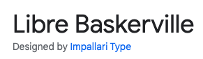

# Book Recommendation Quiz

This book recommendation quiz has been created to allow users to answer questions about their preferences, and receive three personalised book recommendations based on the answers they select. This quiz is designed so that it can be taken on any device, regardless of size or model, and still have a positive and clear user experience. 

[Link to the book recommendation quiz](https://skyeh-m.github.io/Book-recommendation-quiz/)

## Contents 

* [User Experience (UX)](#user-experience-ux)
  * [Project Goals](#project-goals)
  * [Developer and Business Goals](#developer-and-business-goals)
  * [User Stories](#user-stories)

* [Design](#design)
  * [Colour Scheme](#colour-scheme)
  * [Typography](#typography)
  * [Icons and Images](#icons-and-images)
  * [Features](#features)
  * [Accessibility](#accessibility)
  * [Wireframes](#wireframes)

* [Technologies Used](#technologies-used)
  * [Languages Used](#languages-used)
  * [Frameworks, Libraries & Programs Used](#frameworks-libraries-and-programs-used)

* [Deployment](#deployment)
  * [Local Deployment](#local-deployment)

* [Testing](#testing)
  * [Automated Testing](#automated-testing)
    * [W3 Nu HTML Validator](#w3-nu-html-validator)
    * [W3C CSS Validation Service](#w3c-css-validation-service)
    * [Wave](#wave-testing)
    * [Lighthouse](#lighthouse-testing)
    * [JS Lint](#js-lint)
  * [Manual Testing](#manual-testing)
  * [Bugs](#bugs)

* [Credits](#credits)
  * [Code Sections](#code-sections)
  * [Media](#media)
  * [Text](#text)
  * [Acknowledgements](#acknowledgements)

## User Experience (UX)
### Project Goals
The principal goal for this book recommendation quiz site is to allow users to read each of the 10 questions, select an answer for each based on their preferences, and then receive personalised book recommendations. 

* The quiz allows a user to input their name, or a username, so that when given recommendations this is displayed with their name. For example, upon submitting the quiz text will appear stating "Hi (insert username here), you got (insert genre here)! We recommend the following books...". This creates a more personalised feel to the delivery of the recommendations.
* Once a user has answered all 10 questions a message will be displayed, as mentioned above, stating the genre the user has been matched with, this is accompanied by an image of the three book covers corresponding to the genre selected by the user's answers. 
* The quiz will allow users to retake the quiz as many times as they like, either by refreshing the browser, or by clicking the Restart button. This is so that users can see which other books are recommended, or even share the quiz with friends from their own device. 

### Developer and Business Goals
* The footer includes social media icons which contain links to various social media platforms. This pertains to a developer and business goal of encouraging users to visit the content of the business who created the quiz. This seems most appropriate for a book shop where a book recommendation quiz may be utilised to encourage customers to purchase new books they have yet to discover. 
* A key developer goal for this project was to ensure full accessibility for all users of the quiz. This goal informed my decision to not create a quiz with correct answers and a timer as I didn't want to rush users. Part of this consideration was with dyslexic individuals in mind as it will take different people different amount of time to read text.
* A business goal could be to encourage users to share their personalised book recommendations with others, thereby advertising the company behind the quiz. With this in mind there are no copyright images used on the site so users can share screenshots of their results on social media if they wish.

### User Stories
As a user I want to be able to...

1. Read each question and answer clearly, with no text being confusing or obscured by anything else
2. To be able to take the quiz on any device, regardless of size or model, and have a good, uncomplicated experience which only differs slightly depending on screen size. This includes all key functionality of the site working on mobile, tablet, and desktop
3. Answer each of the 10 questions and be provided with an accurate group of recommendations that suit the answers I selected
4. To be able to restart the quiz if I change my mind on an answer for a question I've already answered, and for this to have no negative consequences
5. To be recommended books I might not be familiar with already, but are still likely to interest me

## Design
### Colour Scheme

The colour scheme of the book recommendation site is comprised mainly of white, green, and grey toned pink. 

* White was chosen to focus the eye, and remove background distractions, particularly for the option boxes, so that text was easily readable. Similarly the colour of the social media icons are white to draw the user's eye to them, with the purpose of promoting the company who created the quiz and thus getting more traction online. 
* Green was selected for the footer background, and background of the heading to add a pop of colour, and to compliment, yet provide a difference to the pinkish grey tone of the main container box. The green speaks to the theme of books in general by being evocative of greenery and trees.
* The pinkish grey colour was selected to be a warming compliment to the green and white, and add a bit more diversity of colour. This shade in particular stands out from the light background and so draws the user's eye to the centre of the page where the questions and answers are displayed.

### Typography

[Google Fonts](https://fonts.google.com/) was used to link the fonts used on my site

* Signika Negative is used for the first header element to create a distinction between the header and the main text of the site. This and the font used for the remainder of the text are complimentary fonts so provide a difference without seeming misplaced.

* Libre Baskerville was selected as the core font of the site as it maintains clear readability while conveying a vintage, literature theme to the site as a whole, in keeping with its content and purpose.

### Icons and Images

* The Favicon for the site was created using the [Favicon](https://favicon.io/) website, and the icon files were downloade and saved to my Gitpod workspace. The book icon was chosen to keep in theme with the book recommendation site and to allow users to easily recognise the website tab amidst others in their browser.
* The two book images on the site, the first being on the modal when the site loads, and the second being the main background image of the site, were sourced from [Unsplash](https://unsplash.com/). No rights are my own, and images will be credited later on in this document.
* The image featured on the modal was chosen as books are the key theme of the site, and the unfocused aspect of the image ensures that the image quality won't suffer when translated to smaller, or larger screen sizes. The unfocused nature of the image also serves to give users a thematic representation of what the content of the site will be, without distracting them from the informative text on the modal.
* The background image featuring a page from a book was chosen again for its thematic value, but also to provide an aesthetic element to improve the visual aspect of the site. In my opinion, the background image is not distracting to users, especially as the container for questions and answers has a solid, opaque background color to draw the eye, and allow users to focus on the text.
* On the modal there is an icon of a white book, this was sourced from [Font Awesome](https://fontawesome.com/) and used to create a break in the amount of text featured on the modal. 
* The recommendation images featured at the end of the quiz have been sourced from various publishers, or book retail sites that will be individually credited later in this document. 

### Features
The book recommendation quiz is comprised of three main sections,

1. The modal appears on page load and prompts the user to enter their name, or a username, and gives users information about the quiz.
 * The background colour of the modal was originally a semi-transparent light green, this was later altered to match the dark green on the footer. This was due to an issue of insufficient colour constrast being raised by the Lighthouse program, in order to maintain good readability of text the colour was changed and this issue was resolved. 
 * The username field value is stored and then retrieved later on for the recommendation section, and can be submitted by either clicking the submit button, or hitting the enter key. This is to provide users greater choice in submitting a field, and to avoid a user hitting the enter key and being unsure as to why this hasn't submitted the form.
 * The modal also informs users that they should answer each of the 10 questions posed, and then click the submit button in order to receive their recommendations. 
 * The button that closes the modal is featured prominantely in the top right corner of the modal and upon hovering over it changes colour to black to inform users that the button is clickable.

 2. The question and answer area is comprised of 10 questions, each with 4 options to select from.
 * Upon hovering over an option the option box changes from white to light green in colour to emphasise to the user which button they're selecting. Also on the advice of my mentor Akshat, the final option (once clicked) changes to a dark green to signify that the quiz has come to an end and that the submit button should now be clicked.
 * Once an option has been clicked the quiz automatically moves on to the next question and it's related options. My original design included buttons which would move to the previous, or next question which I removed as I felt it'd be easier from a user experience standpoint for the quiz to move along automatically. This also reduced the risk of having 3 or 4 buttons along the button of the quiz area, which may clutter the screen.
 * The Restart button sits at the bottom of the question area and can be clicked on at any point in the quiz to return the user to the first question. This button exists to allow the user to change the option they've selected for any question if they change their mind, or simply so they can replay the quiz to try to get a different recommendation.

 3. Finally, there is the recommendation area which acknowledges the user by name, and provides an image of three books that would be of interest to the user based on the options they selected.
 * 